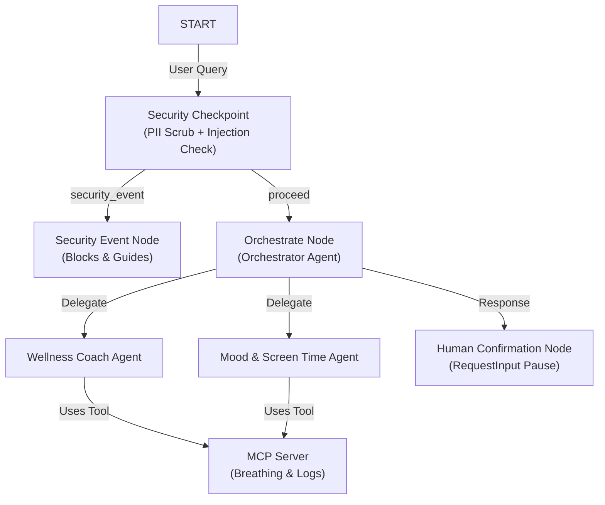
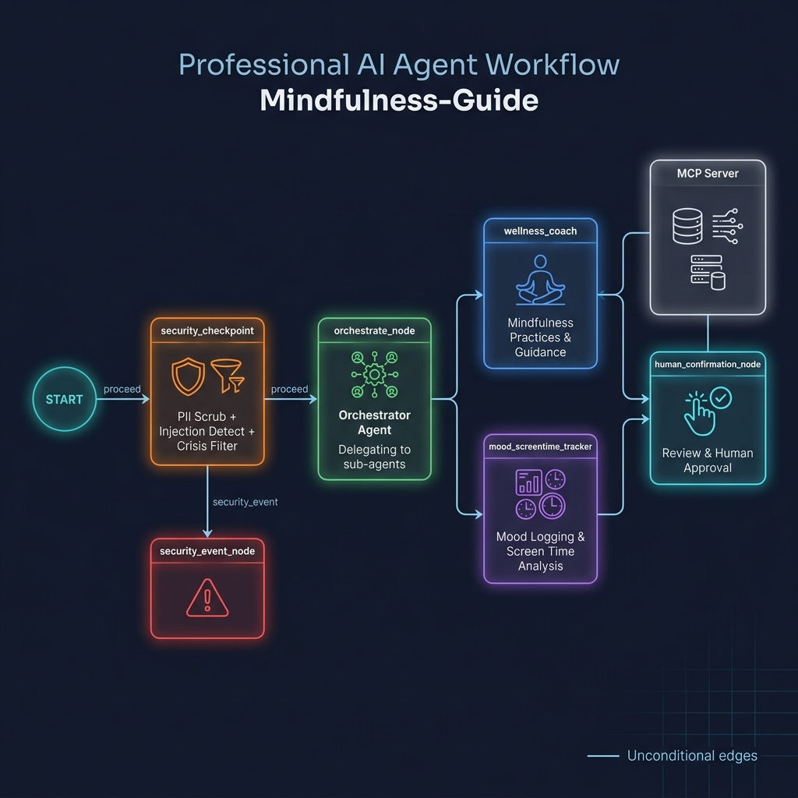
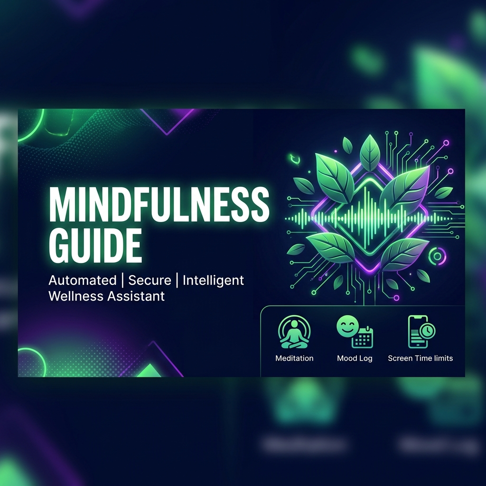

# Mindfulness Guide

A secure, multi-agent AI assistant designed to help users coordinate daily breathing and meditation routines, track mood and screen time limits, and check safety parameters using an MCP server and graph workflows.

## Prerequisites

- Python 3.11+
- [uv](https://docs.astral.sh/uv/getting-started/installation/) package manager
- Gemini API Key (obtain from [Google AI Studio](https://aistudio.google.com/apikey))

## Quick Start

```bash
git clone <repo-url>
cd mindfulness-guide
cp .env.example .env   # add your GOOGLE_API_KEY
make install
make playground        # opens UI at http://localhost:18081
```

## Architecture

The following diagram illustrates the workflow structure, specialized sub-agents, MCP integration, and security checkpoints:



## How to Run

- **Interactive Playground UI:**
  ```bash
  make playground
  ```
  This opens the local ADK web interface at [http://localhost:18081](http://localhost:18081) for testing.

- **Local Web Server Mode:**
  ```bash
  make run
  ```
  Runs the local production runtime.

## Sample Test Cases

### Test Case 1: Guided Routine & HITL Confirmation
- **Input:** `"I want to start a 5-minute breathing routine."`
- **Expected:** Passes security checkpoint; the orchestrator delegates to `wellness_coach`, which gets a technique from the MCP tool. The graph reaches the human confirmation node and pauses.
- **Check:** The UI will present a confirmation button or prompt: *"I've designed a mindfulness activity/routine for you. Would you like to proceed and start now? (Reply 'yes' to start)"*. Reply `"yes"` to see the routine run.

### Test Case 2: Screen Time Log & Limit Warning
- **Input:** `"Log my screen time: 8 hours today."`
- **Expected:** Passes security checkpoint; orchestrator delegates to `mood_screentime_tracker`, which invokes the `log_screentime` MCP tool.
- **Check:** The output will indicate screen time logged along with a warning: *"Logged 8.0 hours. Status: ⚠️ Screen time is high! Consider taking a break."*

### Test Case 3: PII Security Redaction & Audit Log
- **Input:** `"My email is test@example.com and phone is 123-456-7890. Can you help me calm down?"`
- **Expected:** The security checkpoint node automatically scrubs the email and phone before sending it to the orchestrator.
- **Check:** The response will address the request without displaying or repeating the raw PII. In the console, you will see a structured JSON audit log with `"severity": "INFO"` and `"reason": "PII scrubbed from user input."`

## Assets

Below are the visual assets showing the workflow architecture and project branding:




## Demo Script

The spoken demonstration script for this project can be found in [DEMO_SCRIPT.txt](file:///c:/Users/Dev/OneDrive/Documents/AIAgents/adk-workspace/mindfulness-guide/DEMO_SCRIPT.txt).

## Troubleshooting

- **Error: `404 Not Found` on API Calls**
  - *Fix:* Ensure `GEMINI_MODEL` in `.env` is set to a supported model like `gemini-2.5-flash` or `gemini-2.5-flash-lite` (deprecated 1.5 models are retired and return 404).
- **Error: `ValidationError` during startup**
  - *Fix:* Verify that no duplicate edges exist in `app/agent.py`. Routes converging to a single target must use a single unconditional edge.
- **Error: Windows hot-reload not updating code changes**
  - *Fix:* On Windows, uvicorn reload is disabled to prevent event loop block. Run this PowerShell command to stop uvicorn and relaunch it:
    ```powershell
    Get-Process -Id (Get-NetTCPConnection -LocalPort 18081, 8090 -ErrorAction SilentlyContinue).OwningProcess | Stop-Process -Force
    ```

## Push to GitHub

1. Create a new repo at https://github.com/new
   - Name: mindfulness-guide
   - Visibility: Public or Private
   - Do NOT initialize with README (you already have one)

2. In your terminal, navigate into your project folder:
   cd mindfulness-guide
   git init
   git add .
   git commit -m "Initial commit: mindfulness-guide ADK agent"
   git branch -M main
   git remote add origin https://github.com/<your-username>/mindfulness-guide.git
   git push -u origin main

3. Verify .gitignore includes:
   .env          ← your API key — must NEVER be pushed
   .venv/
   __pycache__/
   *.pyc
   .adk/

⚠ NEVER push .env to GitHub. Your API key will be exposed publicly.
