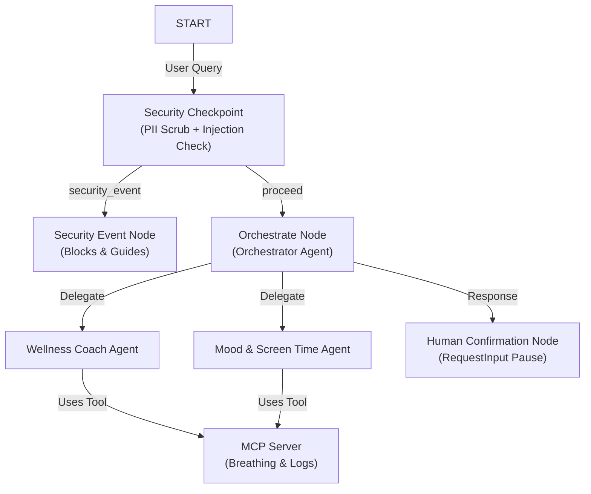

# Submission Write-Up: Mindfulness Guide

## Problem Statement
In today's fast-paced digital world, users struggle to balance their screen time, log their emotional well-being, and practice mindfulness consistently. Wellness tools often lack integrated automation, and generalized AI bots do not have access to structured logs or safety constraints. The `mindfulness-guide` solves this by introducing a secure multi-agent ecosystem that coordinates wellness tasks, integrates with local system data (screen time/mood logs) via an MCP server, and strictly enforces clinical crisis safety guidelines.

## Solution Architecture

The following architecture diagram represents the agent workflow and tool connection:

## Concepts Used

- **ADK Workflow:** Implemented using graph nodes and edges in [agent.py](file:///c:/Users/Dev/OneDrive/Documents/AIAgents/adk-workspace/mindfulness-guide/app/agent.py#L182-L192) to define execution flow, including conditional routes.
- **LlmAgent:** Utilized for specialized sub-agents `wellness_coach` and `mood_screentime_tracker` in [agent.py](file:///c:/Users/Dev/OneDrive/Documents/AIAgents/adk-workspace/mindfulness-guide/app/agent.py#L15-L38) to execute prompt tasks.
- **AgentTool:** Wires the sub-agents into the `orchestrator` in [agent.py](file:///c:/Users/Dev/OneDrive/Documents/AIAgents/adk-workspace/mindfulness-guide/app/agent.py#L39-L56) for intelligent task delegation.
- **MCP Server:** Runs a python stdio server in [mcp_server.py](file:///c:/Users/Dev/OneDrive/Documents/AIAgents/adk-workspace/mindfulness-guide/app/mcp_server.py) to manage database logs and breathing techniques.
- **Security Checkpoint:** Integrated as the entry node in [agent.py](file:///c:/Users/Dev/OneDrive/Documents/AIAgents/adk-workspace/mindfulness-guide/app/agent.py#L57-L135) to handle safety checks.
- **Agents CLI:** Scaffolding, local testing, and playground execution were managed using `agents-cli`.

## Security Design

1. **PII Scrubbing:** Employs regular expressions to scrub email addresses, phone numbers, and SSNs from inputs to protect user privacy.
2. **Prompt Injection Detection:** Filters for malicious override instructions (e.g., "ignore previous instructions") to prevent prompt bypasses.
3. **Medical Emergency & Crisis Filter:** Scans for keywords like "suicide" or "chest pain", immediately logs a `CRITICAL` event, and routes to emergency resources (988 suicide lifeline). This is vital because a wellness app must never try to handle crises or diagnose medical emergencies.
4. **Structured JSON Audit Logs:** Emits structured logs indicating the timestamp, decision, severity level, and reason for safety auditing.

## MCP Server Design

Implemented in [mcp_server.py](file:///c:/Users/Dev/OneDrive/Documents/AIAgents/adk-workspace/mindfulness-guide/app/mcp_server.py):
- `get_breathing_technique(mood)`: Matches user mood to clinical breathing techniques (e.g., Box breathing for stress).
- `log_mood(mood, note)`: Commits user mood notes to log tracking.
- `log_screentime(hours)`: Logs screen time usage and flags excessive thresholds (hours > 6).

## Human-in-the-Loop (HITL) Flow

A `RequestInput` is utilized in `human_confirmation_node` before beginning any routine or logging activity. This ensures the user explicitly consents and confirms they are ready to participate in the physical activity (like taking a deep breath or closing eyes) before the agent starts.

## Demo Walkthrough

1. **Mindfulness Request:** User asks to calm down. The security check proceeds, the orchestrator delegates to `wellness_coach` which uses MCP tool to fetch a routine, and the graph pauses to ask for user confirmation.
2. **Log Screen Time:** User logs 8 hours on screen. The tracker logs it via MCP and issues high screen time status warnings.
3. **Safety Event:** User types "chest pain". The checkpoint immediately intercepts, logs a `CRITICAL` event, and outputs emergency clinical support phone numbers.

## Impact / Value Statement
The `mindfulness-guide` empowers individuals to manage screen time fatigue and mental overload safely. By offloading specialized logic to targeted sub-agents and ensuring strict safety gates, it offers users a reliable, private, and secure partner in daily mental health management.
